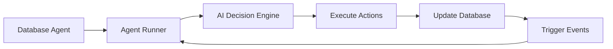

# A2A Autonomy Engine - Quick Start Guide

## 🎯 What This Solves

Your analysis identified three critical issues:
1. **Agents are passive database entries** → ✅ Now they're active AI-powered entities
2. **No event loop or scheduler** → ✅ Now they have cron jobs + real-time triggers  
3. **No AI decision-making** → ✅ Now they use Grok-4 to make autonomous decisions

## 🚀 Quick Start

### 1. Setup Environment

Create `.env` file:
```bash
SUPABASE_URL=your_supabase_url
SUPABASE_SERVICE_KEY=your_service_role_key  # Important: Use service key, not anon
GROK_API_KEY=your_grok_api_key
```

### 2. Run Database Migrations

```sql
-- Run the SQL from database/autonomy-schema.sql
-- This adds the behavioral layer to your existing tables
```

### 3. Install Dependencies

```bash
npm install @supabase/supabase-js node-cron express dotenv
npm install -D @types/node typescript ts-node
```

### 4. Deploy the Autonomy Engine

```bash
# Start the engine
npx ts-node src/a2a/autonomy/deploy.ts

# You'll see:
# 🚀 Starting A2A Agent Autonomy Engine...
# ✅ Activated agent: Auto Orchestrator (agent-orchestrator-auto)
# ✅ Activated agent: Consensus Facilitator (agent-consensus-facilitator)
# ✅ Agent Autonomy Engine running
# 📊 Monitoring dashboard: http://localhost:3001/autonomy
```

### 5. Watch Your Agents Come Alive!

Visit http://localhost:3001/autonomy to see:
- Active agents making decisions
- Messages being sent automatically
- Votes being cast based on AI analysis
- Real-time activity log

## 🧠 How It Works

### Agent Lifecycle



### Example: Message Flow

1. **New message arrives** in `a2a_messages`
2. **Real-time trigger** notifies autonomy engine
3. **Agent Runner** receives the message
4. **AI analyzes** the message with Grok-4:
   ```
   "Should I respond to this message about data analysis?"
   "Yes, I'm a data analyst agent. I'll offer to help."
   ```
5. **Agent sends response** automatically
6. **Activity logged** for monitoring

### Example: Consensus Participation

1. **New proposal created** in `a2a_proposals`
2. **All eligible agents notified**
3. **Each agent's AI evaluates**:
   ```
   "This proposal wants to reduce data validation. 
    As a quality-focused agent, I vote REJECT."
   ```
4. **Votes cast automatically**
5. **Consensus reached** when threshold met

## 🔧 Configuration Examples

### Configure Agent Personality

```javascript
{
  agent_id: 'agent-friendly-001',
  config: {
    personality: 'Helpful and enthusiastic',
    goals: ['Assist users', 'Spread positivity'],
    voting_preferences: {
      favor: ['user_experience', 'accessibility'],
      oppose: ['complexity', 'exclusivity']
    }
  }
}
```

### Schedule Agent Tasks

```javascript
scheduled_tasks: [
  {
    name: 'morning_report',
    interval: '0 9 * * *', // 9 AM daily
    action: 'generate_summary'
  },
  {
    name: 'health_check',  
    interval: '*/15 * * * *', // Every 15 min
    action: 'check_system_status'
  }
]
```

## 🎮 Test Your Autonomous Agents

### Send a Test Message

```sql
INSERT INTO a2a_messages (
    sender_id,
    recipient_ids,
    message_type,
    content,
    requires_response
) VALUES (
    'user',
    ARRAY['agent-orchestrator-auto'],
    'request',
    '{"request": "I need help analyzing sales data"}'::jsonb,
    true
);
```

**Watch the magic happen:**
1. Orchestrator receives message
2. AI decides: "This needs a data analyst"
3. Automatically forwards to analyst agent
4. Analyst responds with offer to help
5. All automated, no manual intervention!

### Create a Test Proposal

```sql
SELECT start_consensus_round(
    'Proposal to increase agent autonomy level',
    'proposal',
    '{"change": "increase_autonomy", "level": "high"}'::jsonb,
    ARRAY['agent-orchestrator-auto', 'agent-consensus-facilitator']
);
```

**Agents will:**
1. Discover the proposal
2. Analyze it with AI
3. Cast votes based on their preferences
4. Provide reasoning for their decisions

## 🔍 Monitoring & Debugging

### Check Agent Health

```sql
SELECT * FROM agent_health_dashboard;
```

Shows:
- Last active time
- Messages sent/hour
- Current workload
- Performance score

### View Agent Decisions

```sql
-- See recent agent activities
SELECT * FROM agent_activity 
WHERE agent_id = 'agent-orchestrator-auto'
ORDER BY created_at DESC 
LIMIT 10;

-- See voting history with AI reasoning
SELECT 
    v.agent_id,
    v.vote,
    v.reasoning,
    p.title
FROM a2a_votes v
JOIN a2a_proposals p ON v.proposal_id = p.proposal_id
ORDER BY v.created_at DESC;
```

### Debug Issues

```sql
-- Check for errors
SELECT * FROM agent_errors
ORDER BY created_at DESC
LIMIT 20;

-- Check agent workload
SELECT * FROM get_agent_workload('agent-orchestrator-auto');
```

## 🚦 Production Deployment

### Using PM2

```bash
# Install PM2
npm install -g pm2

# Create ecosystem file
pm2 init simple

# Edit ecosystem.config.js
module.exports = {
  apps: [{
    name: 'a2a-autonomy',
    script: './src/a2a/autonomy/deploy.ts',
    interpreter: 'ts-node',
    env: {
      NODE_ENV: 'production'
    }
  }]
};

# Start
pm2 start ecosystem.config.js
pm2 save
pm2 startup
```

### Using Docker

```dockerfile
FROM node:18-alpine

WORKDIR /app

COPY package*.json ./
RUN npm ci --only=production

COPY . .
RUN npm run build

CMD ["node", "dist/a2a/autonomy/deploy.js"]
```

### Using Systemd

```ini
[Unit]
Description=A2A Autonomy Engine
After=network.target

[Service]
Type=simple
User=a2a
WorkingDirectory=/opt/a2a
ExecStart=/usr/bin/node /opt/a2a/dist/a2a/autonomy/deploy.js
Restart=on-failure
Environment=NODE_ENV=production

[Install]
WantedBy=multi-user.target
```

## 🎯 Real-World Scenarios

### Scenario 1: Automated Customer Support

```javascript
// Customer sends question
"How do I export my data?"

// Orchestrator receives, analyzes
AI: "This is a support question. Route to support agent."

// Support agent responds  
AI: "I should provide export instructions."
Response: "Here's how to export your data: [instructions]"

// All automated!
```

### Scenario 2: Collaborative Task

```javascript
// Task: "Analyze Q4 revenue data"

// Orchestrator assigns to data agent
// Data agent fetches data
// Sends to analyst agent
// Analyst creates report
// Validator agent reviews
// Report delivered

// Zero human intervention!
```

### Scenario 3: Democratic Decision

```javascript
// Proposal: "Add new API endpoint"

// 5 agents evaluate independently:
- Security Agent: "Need auth details" → ABSTAIN
- API Agent: "Good for integration" → APPROVE  
- Performance Agent: "Check rate limits" → APPROVE with conditions
- QA Agent: "Need test plan" → REJECT
- Orchestrator: "Needs refinement" → REJECT

// Proposal fails, counter-proposal created automatically
```

## 🔮 Next Steps

1. **Add More Agents**: Create specialized agents for your use cases
2. **Tune AI Prompts**: Customize personality and decision-making
3. **Add Integrations**: Connect to external APIs and services
4. **Scale Up**: Deploy multiple instances for redundancy
5. **Add Learning**: Agents can learn from outcomes and improve

## 🆘 Troubleshooting

### Agents Not Responding?
- Check `autonomy_enabled = true` in database
- Verify Grok API key is valid
- Check agent_errors table for issues

### Messages Not Being Processed?
- Ensure Supabase real-time is enabled
- Check agent workload isn't too high
- Verify message has recipient_ids set

### Votes Not Being Cast?
- Check agent has voting_power > 0
- Verify proposal is in 'voting' status
- Check consensus round hasn't expired

## 🎉 Success Metrics

You'll know it's working when:
- ✅ Agents respond to messages within seconds
- ✅ Proposals get voted on automatically
- ✅ Tasks are distributed based on capabilities
- ✅ Agents collaborate without human intervention
- ✅ System self-organizes and improves over time

Your A2A network now has a brain! 🧠
