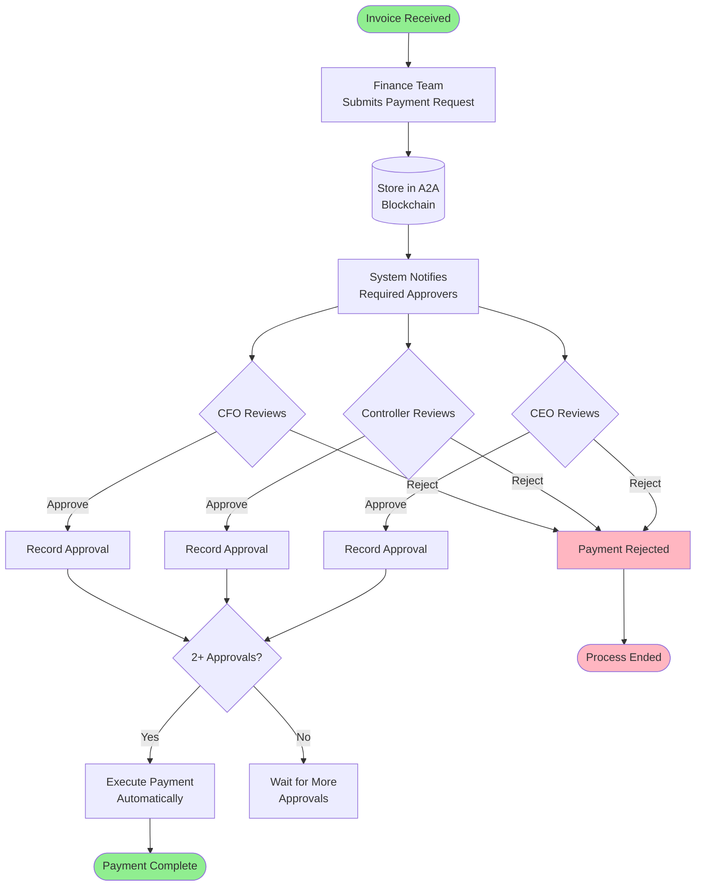
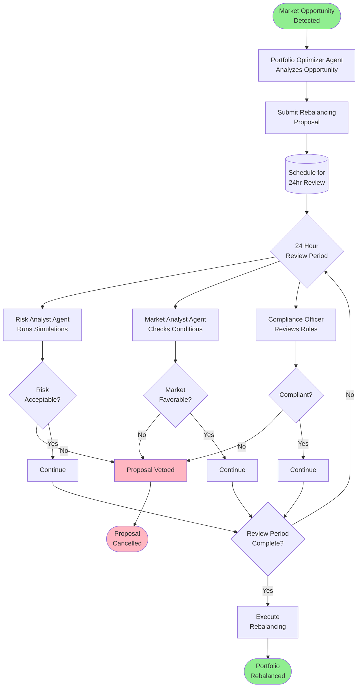
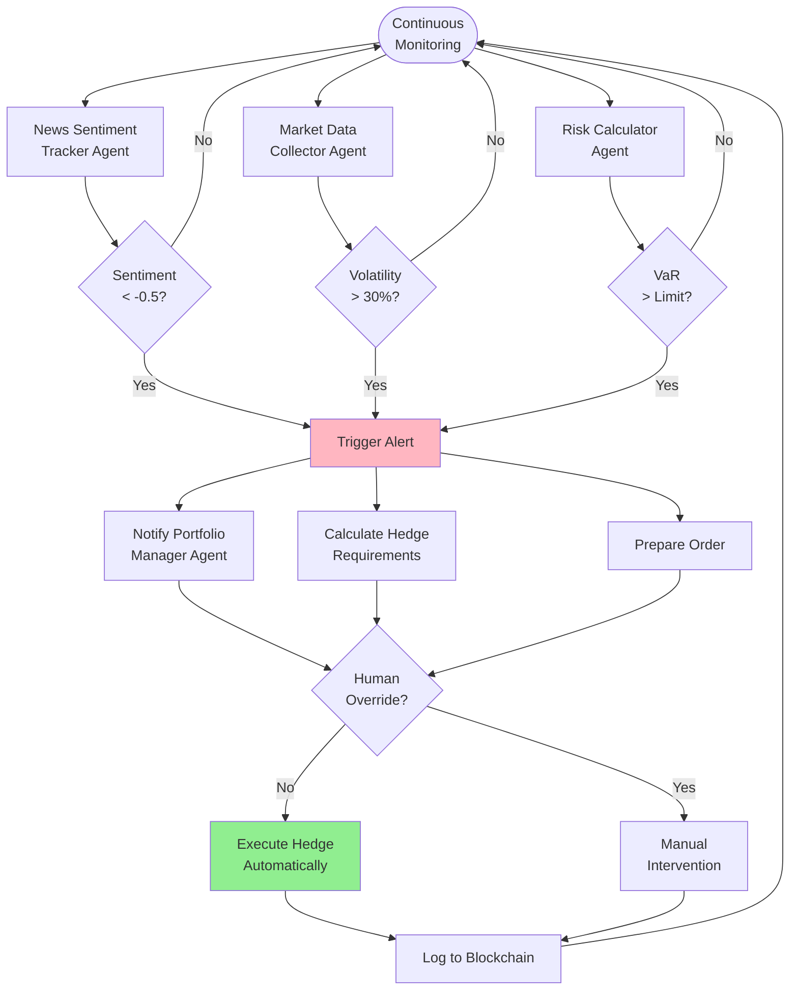
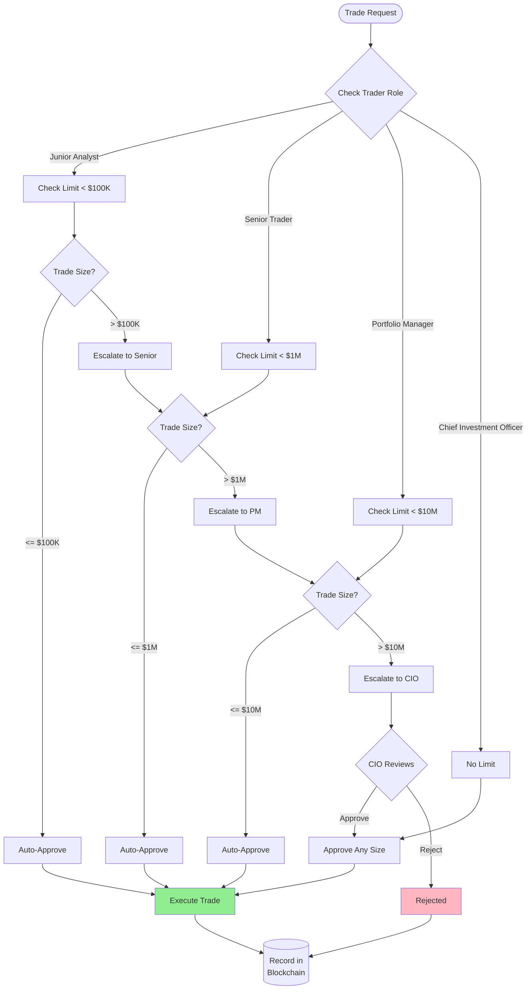
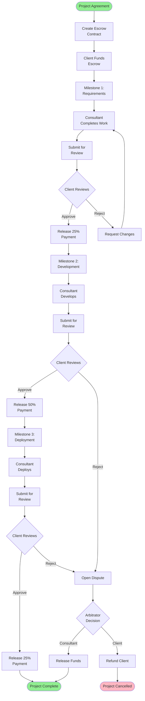

# A2A Smart Contracts as Business Process Diagrams

## 1. Treasury Payment Approval Process

**Use Case**: Company needs to pay a $500K invoice requiring multiple approvals

**Smart Contract**: Multi-Person Approval
**A2A Agents Used**:
- Financial Advisor Agent - Validates payment terms
- Compliance Officer Agent - Checks regulatory requirements
- Risk Analyst Agent - Assesses financial impact

---

## 2. Portfolio Rebalancing with Review Period

**Use Case**: Portfolio manager proposes major asset reallocation

**Smart Contract**: Review Period Enforcement
**A2A Agents Used**:
- Portfolio Optimizer Agent - Creates proposal
- Risk Analyst Agent - Stress tests changes
- Market Analyst Agent - Monitors conditions
- Scenario Analyzer Agent - Runs what-if scenarios

---

## 3. Automated Risk Management Workflow

**Use Case**: Automatic position adjustment based on market conditions

**Smart Contract**: If-This-Then-That Logic
**A2A Agents Used**:
- News Sentiment Tracker - Monitors market sentiment
- Market Data Collector - Tracks volatility
- Risk Calculator - Computes VaR
- Trading Strategy Agent - Executes hedges

---

## 4. Tiered Trading Authority

**Use Case**: Different approval levels based on trade size and role

**Smart Contract**: Role-Based Access
**A2A Agents Used**:
- FX Analyzer Agent - For currency trades
- Credit Risk Agent - For bond trades
- Portfolio Optimizer - For rebalancing
- Compliance Officer - For all trades

---

## 5. Escrow-Based Project Payment

**Use Case**: Milestone-based payments for consulting project

**Smart Contract**: Escrow Management
**A2A Agents Used**:
- Project Manager Agent - Tracks milestones
- Quality Assurance Agent - Validates deliverables
- Financial Controller Agent - Manages payments
- Dispute Resolution Agent - Handles conflicts

---

## Converting BPMN to A2A Smart Contracts

### Step 1: Identify the Pattern
- Multiple approvals → Multi-Person Approval contract
- Time delays → Review Period Enforcement contract
- Conditional logic → If-This-Then-That contract
- Role checks → Role-Based Access contract

### Step 2: Map to Agents
Each activity box in BPMN becomes an agent task:
- Decision diamonds → Agent evaluation
- Process boxes → Agent execution
- Data stores → Blockchain records

### Step 3: Configure in A2A
1. Select template from Trust section
2. Choose agents for each step
3. Set thresholds and rules
4. Deploy to A2A network

### Benefits of BPMN Approach
✅ **Business Users Understand** - No code knowledge needed
✅ **Compliance Ready** - Auditors can follow the flow
✅ **Change Management** - Easy to modify processes
✅ **Testing Scenarios** - Walk through each path
✅ **Documentation** - Self-documenting system

### Tools Integration
Your A2A system can import/export BPMN files:
- Import from Visio, Draw.io, Camunda
- Export for documentation
- Version control process changes
- Simulate before deployment